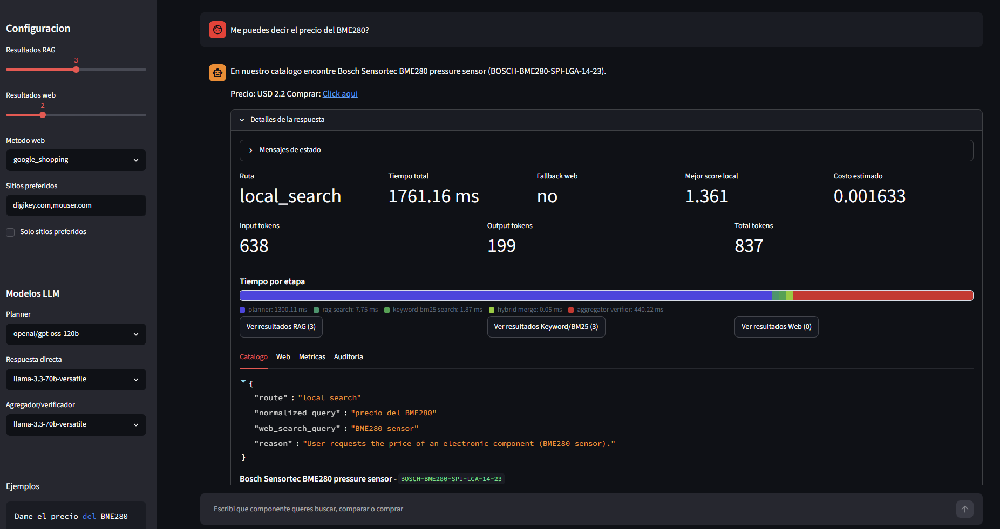

# Asistente de compra de componentes

POC multiagente para NLP3: un asistente conversacional que ayuda a buscar componentes electronicos para comprar. El sistema prioriza un catalogo interno con RAG + Keyword/BM25 y, si no encuentra evidencia suficiente, usa busqueda web externa para encontrar precio y URL de compra.

[](llm-agent-project/docs/video/app_demo.mp4)

Ver demo de la app: [docs/video/app_demo.mp4](llm-agent-project/docs/video/app_demo.mp4)

## Que hace

El usuario escribe una consulta en Streamlit, por ejemplo "precio de ACS71240" o "necesito un capacitor de desacople de 100nF". Un agente planificador decide si la consulta corresponde al dominio del asistente y que herramientas activar. Luego se ejecuta busqueda local sobre catalogo interno y, cuando hace falta, busqueda web externa. Finalmente, un agregador/verificador decide que evidencia usar y responde con componente, precio y link de compra.

La arquitectura usa:

- Streamlit como UI conversacional.
- LangGraph para orquestar el flujo.
- LangChain + Groq para llamadas LLM.
- ChromaDB para RAG local.
- Keyword/BM25 como busqueda lexica complementaria.
- SerpAPI / Google Shopping como fallback web.
- Langfuse para observabilidad.
- Pytest para evaluacion reproducible.

## Documentacion

| Recurso | Link |
|---|---|
| Arquitectura visual viva | [llm-agent-project/docs/architecture.html](llm-agent-project/docs/architecture.html) |
| Informe tecnico PDF | [llm-agent-project/docs/informe/informe_final.pdf](llm-agent-project/docs/informe/informe_final.pdf) |
| Reporte de metricas PDF | [llm-agent-project/reports/metricas.pdf](llm-agent-project/reports/metricas.pdf) |
| Reporte de metricas HTML | [llm-agent-project/reports/eval_metrics_report.html](llm-agent-project/reports/eval_metrics_report.html) |


## Metricas actuales

Ultima evaluacion manual con pytest sobre `llm-agent-project/data/eval/metrics_dataset.json`:

| Metrica | Que mide | Score | Umbral | Estado |
|---|---|---:|---:|---|
| Recall@K | Si el producto esperado o equivalente aparece en el top-k del retrieval local | 0.938 | 0.850 | PASA |
| Context Recall | Si la respuesta final queda soportada por producto, precio, URL y fuente recuperada | 0.875 | 0.850 | PASA |
| Abstencion correcta | Si el agente rechaza consultas fuera de dominio sin activar herramientas innecesarias | 1.000 | 0.900 | PASA |
| Robustez | Caida de recall entre queries limpias y queries con parafrasis/ruido | 0.917 | 0.900 | PASA |

Comando usado:

```powershell
cd llm-agent-project
.\.venv\Scripts\python.exe -m pytest tests\eval\test_metrics_evaluation.py -m eval_metrics --run-eval-metrics -s
```

## Ejecucion local

```powershell
cd llm-agent-project
.\.venv\Scripts\python.exe -m streamlit run app/main.py
```

Para la ingestion de documentos del RAG:

```powershell
cd llm-agent-project
.\.venv\Scripts\python.exe scripts/ingest_catalog_to_chroma.py
```

